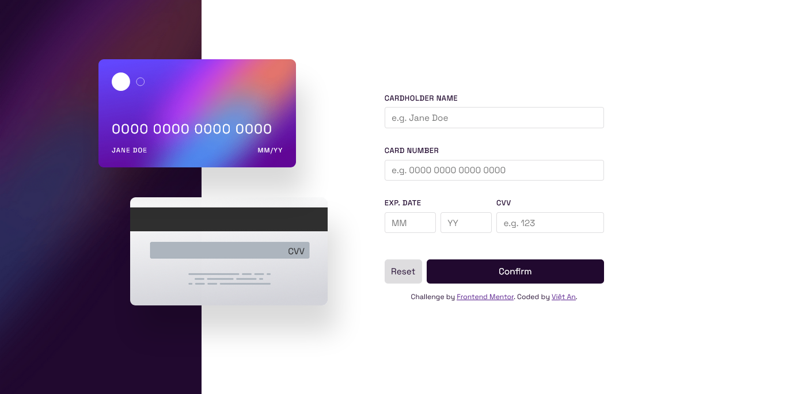

# Frontend Mentor - Interactive card details form solution

This is a solution to the [Interactive card details form challenge on Frontend Mentor](https://www.frontendmentor.io/challenges/interactive-card-details-form-XpS8cKZDWw). Frontend Mentor challenges help you improve your coding skills by building realistic projects.

## Table of contents

- [Overview](#overview)
  - [The challenge](#the-challenge)
  - [Screenshot](#screenshot)
  - [Links](#links)
- [My process](#my-process)
  - [Built with](#built-with)
  - [What I learned](#what-i-learned)
- [Author](#author)

## Overview

### The challenge

Users should be able to:

- Fill in the form and see the card details update in real-time
- Receive error messages when the form is submitted if:
  - Any input field is empty
  - The card number, expiry date, or CVC fields are in the wrong format
- View the optimal layout depending on their device's screen size
- See hover, active, and focus states for interactive elements on the page

### Screenshot

### Links

- [Solution Page on Frontend Mentor](https://www.frontendmentor.io/solutions/interactive-card-details-form-using-react-and-sass-2jfMCUIW8t)
- [Live Website](https://fm-interactive-form-vietan0.netlify.app/)

## My process

### Built with

- [React](https://reactjs.org/)
- Semantic HTML5 markup
- Flexbox

### What I learned

- Freshen React knowledge
- `maxlength` attr on `input` - no JS required!
- `e.preventDefault()` to stop button from sending `POST` request immediately
- Remember to `import` images through React, not write `<img src=...` directly

## Author

-   Frontend Mentor - [@vietan0](https://www.frontendmentor.io/profile/vietan0)
-   Linkedin - [@vietan](https://www.linkedin.com/in/vietan/)
